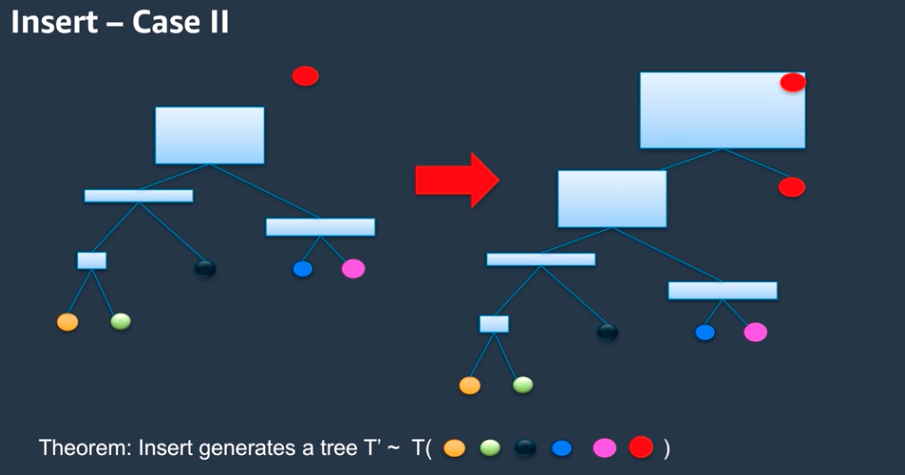

# Anomaly Detection

- Random Cut Forest is AWS's algorithm used internally
- generates anomaly score, can analyze multiple dimensions at once

## How to set up

- generates a "random cut" somewhere along the longest dimension
  - recursively continues to do this, each time drawing the bounding box around the remaining data points
  - stops when each point is isolated (every point becomes a leaf)
  - this becomes the tree
- forest implies multiple trees
  - build many of these trees in parallel on a random subset of the data (number of trees is hyperparameter)
  - random sample on stream based on [Reservoir Sampling](https://en.wikipedia.org/wiki/Reservoir_sampling)
    - maintains a list of k elements
    - each time a new observation comes in, randomly decide to keep or discard
  - then apply that observation to the tree of bounding boxes
    - delete: remove parent node, move other observation up
    - insert: start at root node, go down tree according to which bounding box it fits in
      - at the point it doesn't fit, gets to be a leaf node
      - if it doesn't fit in the root bounding box, then create a new root that incorporates it and move the old root down a level

## How to use it to generate anomaly scores

Anomaly score is calculated by displacement

- displacement is the sum of heights of all items in the tree
- adding a new item at the bottom of the tree (fit in the bounding boxes all the way down) has minimal impact
- adding a new item halfway up the gree (fit in some of the bounding boxes) has greater impact since a larger number of points got their displacement increased
- adding a new root increases the displacement of all existing points, leading to the greatest impact

## Algorithm Summary

- many trees in the forest
- do a "fake insertion" of each new item on all trees to see what displacement change it would generate
- do a random "real insertion" after score generated to some of the trees to move them forward in time
  - probability affects how long of a memory the model has (last 5 minutes vs last 5 days)

## Practical Concerns

- recurring patterns (daily cycle) are not anomalous
  - "shingling" takes a time slice (day) and breaks it down into multiple dimensions (48 30 minute sections) to treat each one more separately
- streaming use cases more natural, but might not be ready to use it on live data just yet
  - can stand up a temporary stream to push historical data through to validate scores
- Sagemaker integration
  - works in batch mode
  - purposefully does not learn over time: static model you decide when to train
  - shingling needs to be done manually when prepping data
  - you can have labeled data (Y/N) which can help inform the model how tight or wide of tolerances you want based on standard deviation of the scores
