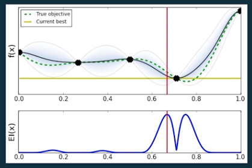

# Amazon Sagemaker

- notebook instances
  - Jupyter
  - Anaconda
  - Spark
- training
  - additional compute capacity on demand over notebook
  - Sagemaker algorithms (optimized for distributed training), mxnet/tensorflow, or bring your own algorithm
- hosting
  - A/B testing
  - auto scaling

## Sagemaker Neo

- takes care of the problem of N frameworks to M hardware deployment options
- intermediate compilation step to increase portability
- components
  - compiler
    - converts specific functions/operations into framework agnostic representations
    - does optimizations
  - runtime library
    - uses the framework agnostic representations to run inference

## Automated Model Tuning

- hyperparameters control the learning process
  - learning rate
  - number of layers
  - regularization: penalize large weights
  - drop-out: drop nodes to prevent over-fitting
  - trees
    - number
    - depth
    - boosting step size (how different the trees are)
  - clustering
    - number
    - initialization strategy
- tuning can have a large impact on performance (like 10%)
- challenges
  - hyperparameter combinations grow expoentially as you add more
  - interactions/non-linearity in results
  - evaluations are expensive (have to train whole model)
- methods
  - manual
    - guess and check
    - experience/intuition
  - brute force
    - grid (like experimental design course)
    - random: works better than you'd expect because one hyperparameter might have a larger effect than all the others. Random will let that parameter take on more values than grid and explore the space better
    - sobol: combination of grid + random
    - meta model: build a machine learning model to optimize hyperparameters
- Sagemaker process
  - **Gaussian process regression** to model the objective metric as a function of hyperparameters
    - assumes smoothness (a bit of a change shouldn't have huge effects, so matches assumption)
    - low data: good since multiple model training runs are required
    - provides confidence estimates
  - **Bayesian optimization** decides where to search next
    - explore and exploit: large area search, then try more in "good" areas
    - does not require gradient to be known like in the case of gradient decent: can do it with less data points
  - graph below
    - top plot is loss function value for various values of the hyperparameter (gaussian process regression)
    - bottom function is where is the expected best optimization to search next (baysean optimization)
      - naturally will start splitting the response area (since largest area between points, more unknown it needs to map out)
      - then when a minimum is found, it will weight to closer to that
  - also works with custom algorithms since can work as a black box

## SageMaker Spark

- Spark local on SageMaker instance or on EMR
- [Sagemaker-Spark SDK](https://github.com/aws/sagemaker-spark)
- Spark MLLib Classes
  - Input Data: `DataFrame`
  - Algorithm: `Estimator`
  - Model: `Model`
- Spark interface creates the Sagemaker training job, model, endpoint configuration, and endpoint in `fit()` method
- `transform()` method generates the predictions
