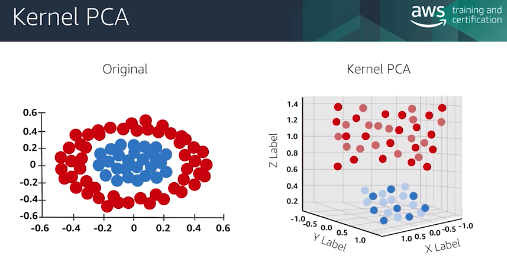

# Model Training, Tuning, and Debugging

## Neural Networks

- Perceptron
  - simplest neural network
  - list of input features
- Neural networks
  - input layer, output layer, and hidden layers
  - hard to interpret
  - generally expensive to train, fast to predict
- Convolutional neural network (CNN)
  - convolutions are filters, feed into next layer
  - pooling takes 4x4 matrix to single scalar by either max or average
  - alternate convolution + pooling?
  - once done with convolutions/pooling, feeds into fully connected layers
- Recurrent neural network (RNN)
  - has feedback to previous layers to model order of observations

## K Nearest Neighbors (KNN)

- calculate response of a new observation based on how close it is to the training data set
- need to define distance between observations
  - [Euclidean distance](https://en.wikipedia.org/wiki/Euclidean_distance)
  - [Manhattan distance](https://en.wikipedia.org/wiki/Taxicab_geometry)
  - any vector norm
- find the `k` nearest neighbors to the new observation we want to classify
  - `k`=6, class `a`=3, class `b`=2, class `c`=1 -> observation classified as `a`
  - commonly use `k = sqrt(N)/2`
    - smaller `k`: more local
    - larger `k`: more generic
- non-parametric
  - did not create any functions or create any models
  - has to remember all training data for inference
  - space and prediction time complexity grows with size of training data
  - the more dimensions, the more sparse your data gets
    - single factor 0 to 1 with 100 points is the same as three factors with 100^3 = 1,000,000 data points

## Linear and Non-Linear Support Vector Machines

- uses linear separability (if you plot the observations on N dimensions and draw a line between them)
- finds optimal hyperplane to maximize margins from support vectors (training examples close to the boundary)
- nonlinear SVM
  - choose a distance function named a "kernel"
  - use that function to map into a higher dimension space
  - now can use linear SVM in the new space
- not memory efficient since stores support vectors

## Decision Trees and Random Forest

- benefits
  - automatically picks features and tunes thresholds
  - easy to interpret
  - less need for transformation
- cautions
  - potential for overfitting, need to prune
- entropy: relative measure of disorder in data source
  - disorder is present when distinction between two or more observable groups (targets) is not pure
    - 50 customers approved, 50 rejected in same group
  - as you sub-divide data, you get to more pure (20 approved, 1 rejected)
- methodology
  - nodes are split based on the feature that has the largest information gain (IG) between parent and split nodes
  - one method to quantify IG is comparing entropy before and after splitting
  - You could go all the way until response is pure with one class, but generally stops at a certain criteria to prevent overfitting
- Ensemble method/Random forest
  - randomly select subset of training data (both observations and features) to create multiple trees
  - use majority voting to pick label
  - more expensive to train since training potentially 100s of trees

## Model Training: Validation Set

- features, model selection, and hyperparameter tuning are an iterative process
- tuning goals
  - detect if overfitting or underfitting
  - find any special cases where the model gives inaccurate results
- **Testing Data != Validation Data**
  - training data + testing data = whole
  - training data further split down into training set and validation set
    - your iterative model selection and model tuning target improvements in the validation set
    - this can lead to overfitting towards the validation set
    - keeping the testing data until the very end and using it only once lets you test true generalization of the model
  - problems
    - in small data sets, your validation data set might be too small to be representative, or your training data set might be too small to train on
    - solution
      - use [cross-validation](https://towardsdatascience.com/cross-validation-in-machine-learning-72924a69872f) ("k-fold" and "holdout method")
      - separate training data into chunks (just say 5 of 20%). One chunk is the validation data set, but try 5x and use a different one each time

## Model Tuning: Bias Variance Tradeoff

- [Towards Data Science](https://towardsdatascience.com) articles
  - [Regularization](https://towardsdatascience.com/regularization-in-machine-learning-76441ddcf99a)
  - [Balancing Bias and Variance](https://towardsdatascience.com/balancing-bias-and-variance-to-control-errors-in-machine-learning-16ced95724db)
  - [Cross-Validation](https://towardsdatascience.com/cross-validation-in-machine-learning-72924a69872f)
- definitions
  - total error (x) = bias^2 + variance + irreducible error
  - bias: "systematic different between true model and estimated model"
  - variance: "given a data point, what is the range of response I would get back from the model"
- results
  - high bias: indication of under-fitting since the model isn't lining up with the real values
  - high variance: indication of over-fitting since small change in input leads to a large change in output
- "total test error"
  - variance + bias ^2
  - want to minimize this

- using learning curves to evaluate the model
  - detect if model is under or over fitting
  - also can show the impact of training data size to see if you can train in smaller batches or need more data (when convergence slows down)

## Model Tuning: Error Analysis

- types
  - classification: easy to use confusion matrix to look at which ones went wrong and in what ways
  - regression: need to analyze residuals (difference between actual and predicted), look at outliers, which direction it is wrong more often, etc
- common problems
  - data problems (standardize variants of a word)
  - labeling errors
  - under or over-representation of a class

## Model Tuning: Regularization

- motivation
  - lots of features make it into the models, leads to overfitting
  - regularization: add penalty score into the const function for complexity
- types
  - can calculate penalty by the sum of the absolute value weights of each feature
    - **important**: each variable must be scaled to the same scale, i.e. 0-1. This makes the weights be on an even playing field
  - cost function combines MSE (mean squared error) and the penalty term
  - linear regression example:
    - L1 = abs value of weight, can be used to drop out terms
    - L2 = square of weight, generally don't drop out, but will decrease weight of unimportant terms
  - regularization strength `alpha` adjusts the weight between MSE and the regularization penalty

## Hyperparameter Tuning

- definition: an external configuration whose value cannot be estimated from the data
  - things like learning rate, number of trees in a random forest, etc
- techniques
  - grid search: make N dimensional grid and try them all. Very compute intensive
  - random search: just what it sounds like 😄
  - Sagemaker uses bayesian search to automatically stochastically find a local max (hopefully close to full max)
- takes knowledge of good ranges for this algorithm related to the characteristics of a data set

## Model Tuning: Training Data Tuning

- training data issues
  - too small (too much overfitting): sample or label more
  - biased/missing scenarios: need to get those scenarios
  - example: fraud detection
    - have a lot less fraud than normal transactions
    - can duplicate observations to generate more data
    - use **SMOTE** to generate synthetic data points with the major features
      - > synthetic minority oversampling technique
      - can under-sample on the majority class and over-sample the minority
      - training data doesn't need to be representative of the real world, but _testing data needs to be real_
- dimensionality reduction
  - automatic feature creation available (pandas `get_dummies`, polynomial/interactions, etc) that can create hundreds of new features
  - having too many features can make the model too flexible and can over-fit
    - some algorithms also can't handle high dimensionality sparse data like K nearest neighbor
  - want to find the most significant features

## Model Tuning: Feature Extraction

- mapping the data to smaller number of features that retains the majority of the information
- principal component analysis (PCA)
  - linear relationships
  - just looks at features, not target/label
  - looks for highest variance direction in N dimensional space, then next one orthogonal to that, and so on
  - just say first 4 out of 10 features explain 90% of the variance, then we might just stick with those
- kernel PCA
  - do a non-linear transformation that changes the data into a linear relationship to do PCA on
  - example below: function of distance from center

## Model Tuning: Feature Selection

- linear discriminant analysis (LDA)
  - supervised linear approach to feature extraction
  - transforms to subspace that maximizes separability
    - as a feature extraction tool, max features is number of classes - 1
  - assumptions
    - data is normally distributed
    - different classes share same covariance
  - [different from SVM](https://stats.stackexchange.com/questions/243932/what-is-the-difference-between-svm-and-lda/243947)
    - SVM does not make those assumptions

## Model Tuning: Bagging/Boosting

- use subset of rows/features in random fashion
- **bagging** (bootstrap aggregation)
  - create x data sets of size m (random rows, rows can be selected more than once per data set)
  - subset of features
  - train each model, validation set is rows that weren't selected
  - combine several weak learners through average (regression) or voting (classification)
  - can help with models that have high variance and low bias, decreasing over-fitting problem
- **boosting**
  - assign strengths to each weak learner
  - iteratively train weak learners by training them on the misclassified observations of the previous weak learners
    - try model 1, if it fails train model 2 with that
  - helps with models that have high bias and need more explaining power
  - common algorithm is `XGBoost`, does well on most tabular data
