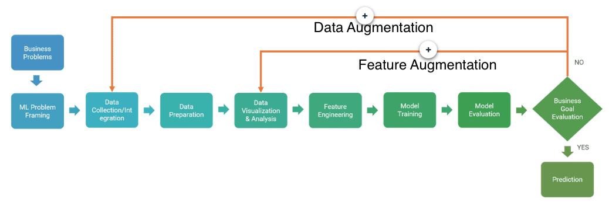

# Problem Formulation and Exploratory Data Analysis

## Problem Formulation

- What is the problem you need to solve?
  - consequences of getting the prediction wrong in different ways (false positive vs false negative)
- What is the business metric?
  - examples
    - cost efficiency? (less human involvement)
    - speed to answer? (less human involvement)
    - accuracy of answer?
  - link business goals to analytics metrics that can be tracked
- Is the ML approach appropriate?
  - can the problem be solved more simply with rules?
  - are the patterns to difficult to code for?
  - is there a lot of high quality data available for training?
- What data is available??
  - determine the gap between the data you want and the actual data that is available
  - is there a way to add more data?

## Data Collection

Doesn't only occur at the start of a process, iterative and occurs throughout

- look for underrepresented groups when building a model and try to get more data around them
- capture data in production to monitor the model's performance and see when it is getting out of whack

## Sampling

Must be representative of the expected production population, unbiased

### Strategies

- Random sampling
  - pro: most representative of the population as a whole (as opposed to sampling a convenient subgroup)
  - con: rare sub-populations can be underrepresented or not represented at all
- Stratified sampling
  - apply random sampling to each subpopulation
  - usually sampling probability is the same for each stratum
    - sometimes you will use different probabilities to give weight to one subcategory (like sampling more fraudulent transactions since they are a small part of the overall population)

### Issues

- Seasonality
  - cyclic patterns like time of day, day of week, holidays, etc
  - stratified sampling across these can minimize bias
  - visualization can help identify
- Trends
  - patterns shifting over time, new patterns emerging
  - compare models trained over different time periods
  - _consider using validation data that was gathered after training data_
- Leakage
  - train/test bleed: inadvertent overlap of training and test data
  - using information found at train/test time but not in production

## Labeling

Depending on the problem type, the data might inherently come with labels or require human labelers

- Human labeler guidelines
  - critical to get right
  - construct simplest Human Intelligence Task (HIT) to minimize ambiguity
  - poor design can decrease labeler productivity and/or introduce bias

Sampling and Treatment Assignment

- random sampling needed to be able to generalize to the larger population
- random assignment within the sample needed to establish causation. If there is a correlation in the results under non-random assignment, it could be the other assigning factors that influenced the results.

## Exploratory Data Analysis (EDA)

Iterative process to get to know the data and its relationships better

- Domain Knowledge
  - Domain knowledge helps you figure what the relevant data is: most important features, what data is missing
- Data Schema
  - S3 is the collection point (redshift, glacier, dynamodb, RDS, CSV) which then can feed on to Sagemaker
  - merging data can be complicated when values are missing

### Statistics

- Dimensions: instances = rows, attributes = columns
- Univariate attribute statistics
  - numeric: mean, variance, `df.describe()`, histogram
  - categorical: number of unique values, most/least frequent values, percentages of observations, histogram
  - target/label/response: similar methods, categorical look at count of unique and see if it is balanced
- Multivariate statistics
  - scatter matrix
    - `pd.scatter_matrix(df[['col1','col2','col3']], figsize=(15,15))`
    - can do different colors in a scatter plot highlighting different target classes
  - contingency tables/cross tabulation
- [Correlation](https://en.wikipedia.org/wiki/Pearson_correlation_coefficient)
  - correlation matrix gives a number in range [-1,1] with 0 as no correlation
  - this just measures linear correlation, not other types of relationships
  - generally easiest to view in color coded heat map

### Data Issues

- Messy
  - unstructured needs to be put through cleansing
  - observations on different scales: some in miles and others in km
  - mixed type data: each feature must be put in its own column: 5:40:27 vs 320 MB/s
- Noisy
- Biased
  - when data was created, there was something preventing a representative sample from being gathered
    - certain types people might not want to answer certain questions on surveys, will be under-represented
    - we don't know how loans turned out that we didn't get
- Imbalanced
  - can cause the model to overwhelmingly pick the class that had more observations
- Correlated
  - hard to know which feature to attribute significance to - [collinearity](https://en.wikipedia.org/wiki/Multicollinearity)
