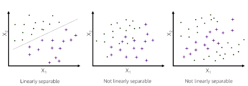

# Introduction to Data Science

### Rationale

- data is the key of machine learning, solution is only as good as the data it's built upon
- ML technique choice depends heavily on data available

### Goal of machine learning

Given a training set, find approximation of the underlying function (that maps data attributes to target values) that best generalizes, or predicts, labels for new examples.

# Types of Machine Learning

- **Supervised**
  - true label provided, model learns from feedback of labels within training data set
  - categories
    - regression: continuous numerical value
    - classification: categorical (binary or multi-class)
- **Unsupervised**
  - no target outcome/label
  - Common tasks
    - look for clusters based on relative differences of observations
    - dimensionality reduction by identifying covariant features
  - "semi-supervised" is where some items have labels and others don't
- **Reinforcement**
  - algorithm not told which answer is correct, but given reward or penalty based on performance

# Key Issues in ML

### Data Quality

- consistency
  - gathered in a consistent manner over time and locations?
  - aligned with business problem we want to solve?
- accuracy: are labels and features correct?
- noisy data: fluctuations in input/output that make it hard to see patterns
- missing data
  - many ML algorithms can't deal with missing data
  - might have to fill them in via default or mean value, otherwise drop observation
- outliers: errors, typos might need to be identified and removed
- bias: need to find and be aware of

### Model Quality

- underfitting:
  - too simple, flexible enough to model the real pattern
  - not enough predictive power
- overfitting
  - model tracks training data too closely, "memorizes" noise and attempts to extrapolate that on predictions
  - this leads to not generalizing well on new data
  - corresponds to high variance - small change in training data leads to a big change in output
  - more common problem than underfitting

# Machine Learning Methods: Linear Regression

### Linear Methods

- function form is `f(x) = Φ(w^t * x)`
  - `Φ` is activation function
  - `w^t` is weight
  - `x` is observation
- optimize by gradient descent
  - simple for one computer, everything in method
  - stochastic method with mini-batches for multi-computer distributed

### Univariate Linear Regression

- single feature and real value response
- only two parameters, `w0` (intercept) and `w1` (slope)
- best line minimizes sum of squared error
  - squared error is partially chosen since easier to compute than abs value or another function
  - also that we assume Gaussian distribution (0 centered, fixed variance, aka normal distribution/bell curve) and squaring helps react more to outliers, pulling in the line faster

### Multivariate Linear Regression

- N explanatory variables with N>2
- form: $y = w_0x_0 + w_1x_1 + w_2x_2 + ... + w_mx_m =\sum\limits_{i=0}^N w_ix_i$
- sensitive to correlation between features
- `sklearn.linear_model.LinearRegression`

### Logistic Regression

- uses an activation function to push the probability result to one of the two classes (true or false)
  - sigmoid function maps negative infinity to 0 and positive infinity to 1, a probability outcome
- form is a linear combination of all features: $z = w_0 + w_1x_1 + ... + w_nx_n$
  - `z` can be any real number
  - training data descends on actual numbers for `w0` through `wn`, which then are used to find an actual `z` for a new observation. That `z` is fed into sigmoid for a probability between 0 and 1
- important: sensitive to outliers in training data
- `sklearn.linear_model.LogisticRegression`

### Linear Separability

Can you separate the features in a linear fashion?

- plot the observations on a scatter plot with the same number of dimensions as input variables (line for one, 2d for 2, 3d for 3) and output class is color
- can a line be drawn to separate the output classes (colors)?

