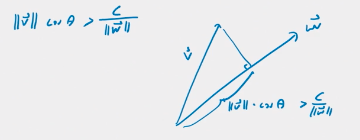

# Matrices

## Motivation

- column vector of counts per class, row vector of weights aligning to the column vector of features
- row and col vectors: `w X v = sum from 1 to n of w_i * v_1` (X is cross product)
- order matters

## Dot Products

- given two column vectors `v` and `w`, `v * w = v^T X w` (\* dot product, T transposed, X cross product)
- dot product lets us abstract the idea of angles into N dimensions
- dot product is the product of the norms (lengths) times the cosine of the angle between them: `v*w = ||v|| ||w|| cos(theta)`
- orthogonality: `v*w = 0`
  - If v and w are non zero, then to be orthogonal, theta must be pi/2 or -pi/2 (90 or -90 degrees)
  - in three dimensions, there is a plane (2 dimensions) of vectors orthogonal to a vector (n-1)
  - "positive inner product" is when vectors have an angle < 90 degrees between them, point in somewhat same direction
  - "negative inner product" is when vectors have an angle > 90 degrees between them, point in somewhat opposite direction
- hyperplane: "the thing orthogonal to a given vector
  - line in 2d, plane in 3d, higher is n-1 dimensions in a similar fashion
  - generally examples pass through the zero vector of that plane, but can be translated to somewhere else
- decision plane
  - data vector (column) `v`, weight vector (row) `w`
  - answers the question: does this weight vector `w` applied to feature vector `v` exceed threshold `c`
  - "is the projection of `v` onto `w` more than `c/||w||`"

## Matrix Multiplication

- motivation
  - single feature example is a column vector of an observation X a row vector of weights
  - we want to do more than one feature
  - `v` is the vector where `v_i` is the number of `i` family homes
    - number of families feature is `v` multiplied by weights of `w_i = i`
    - number of homes feature is `v` multiplied by weights of `w_i = 1` (constant)
    - matrix W (size j,1000) is both those weight vectors stacked. When multiplied by V (1000,1) you end up with a result vector of size (j,1)
  - similarly we can do it on multiple observations by having a data matrix with multiple columns instead of just one observation

## The Hadamard Product
